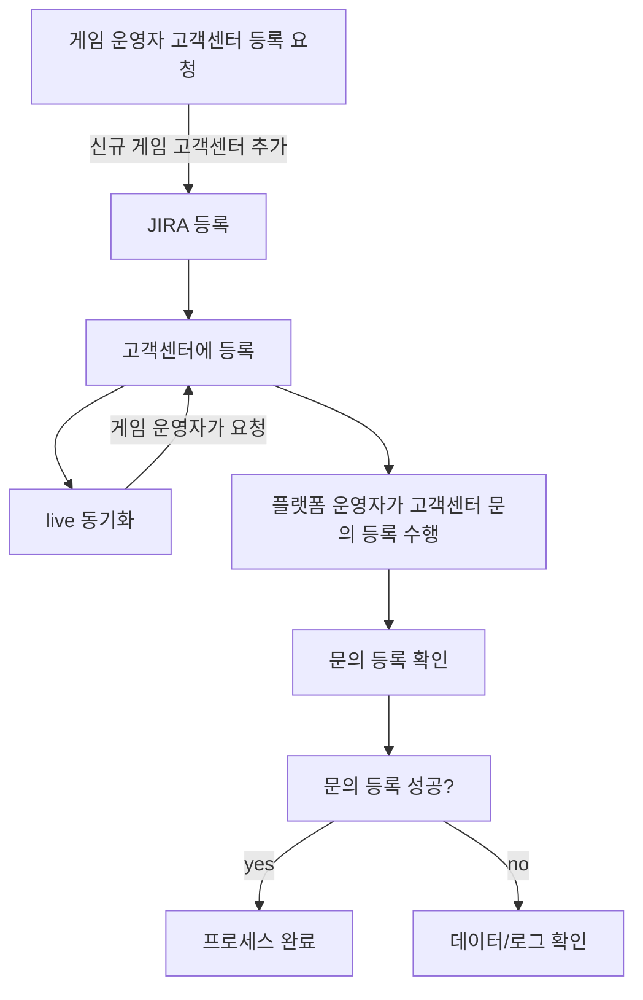
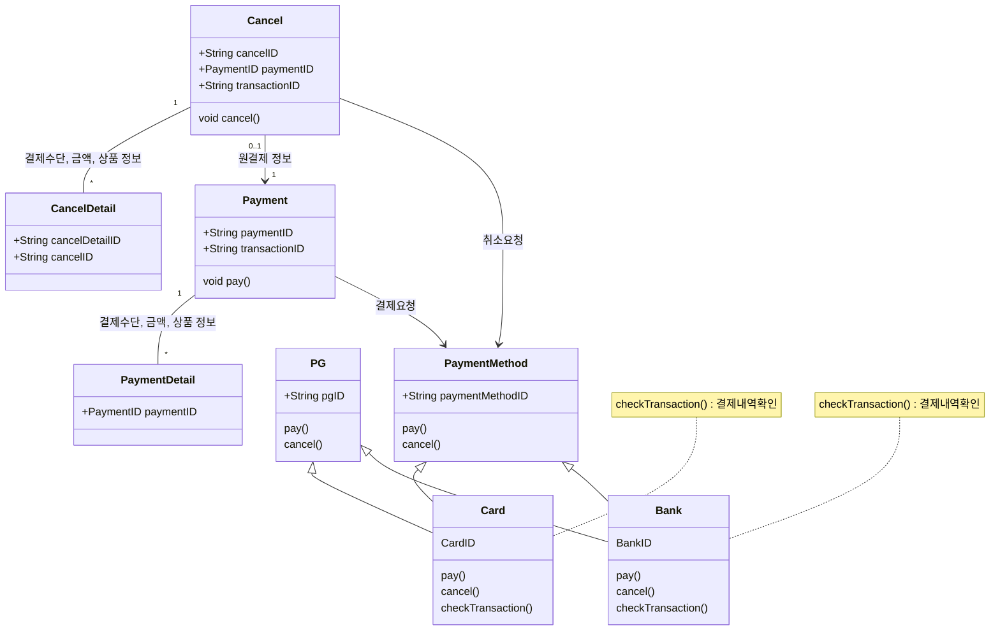
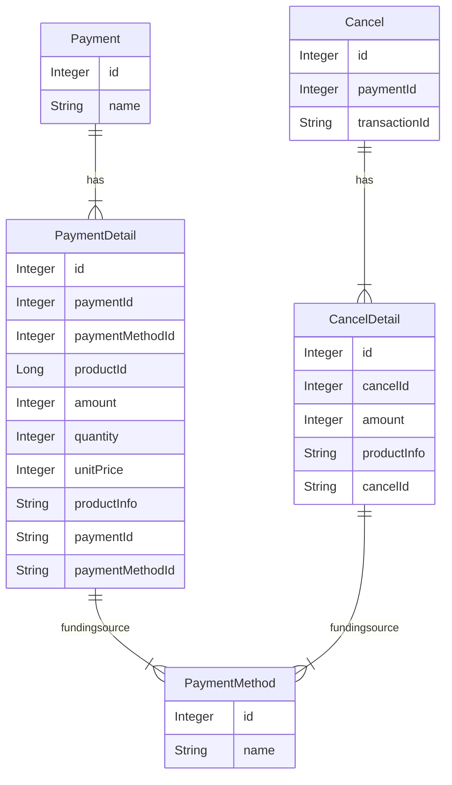
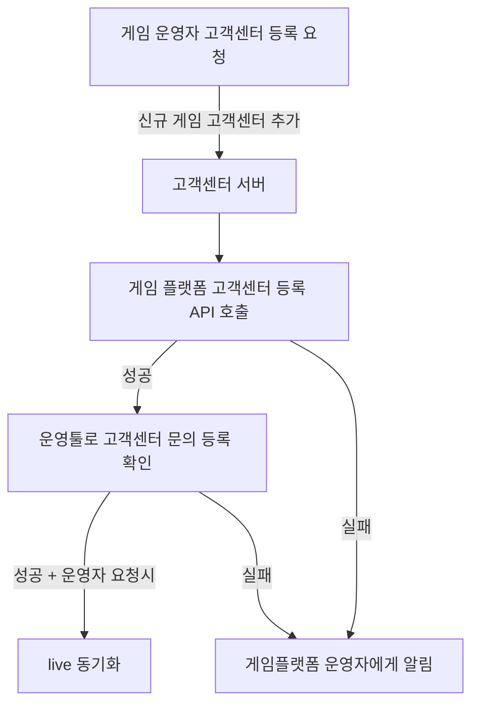
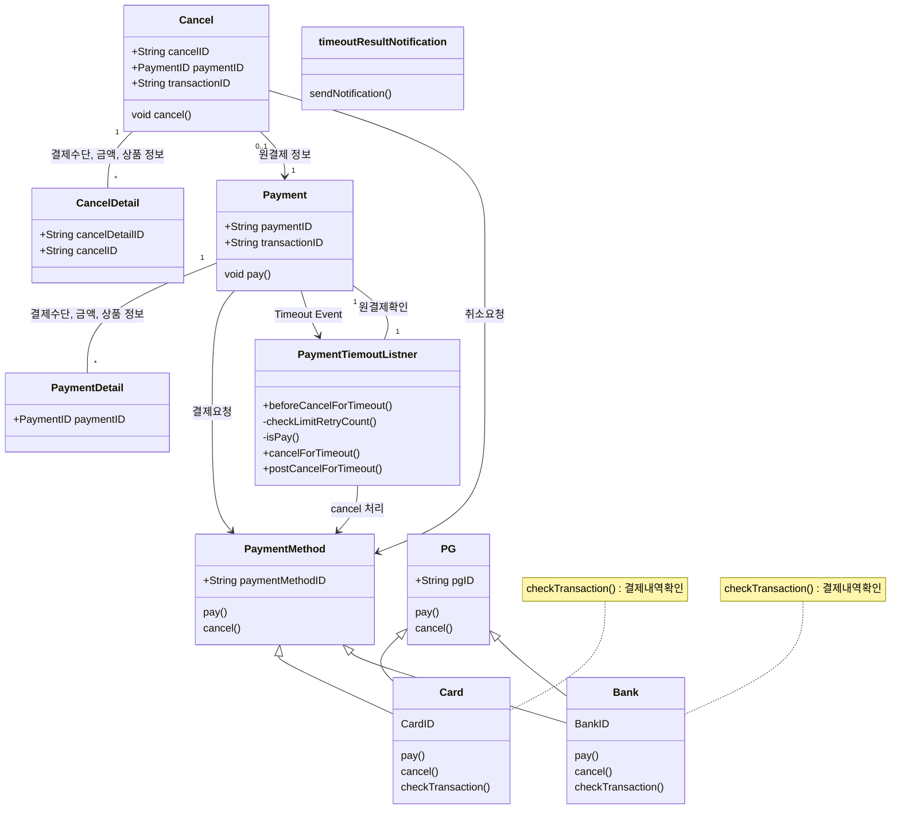
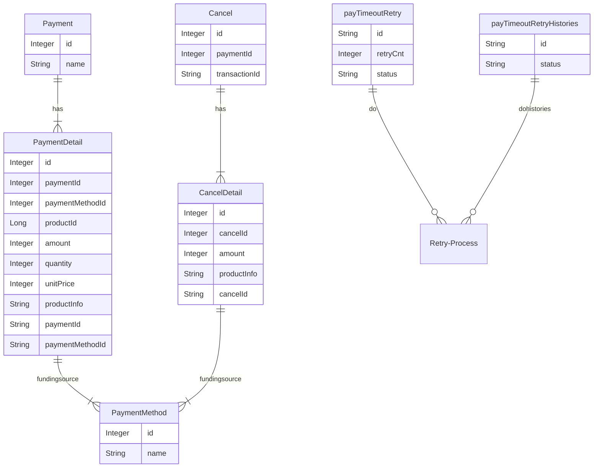
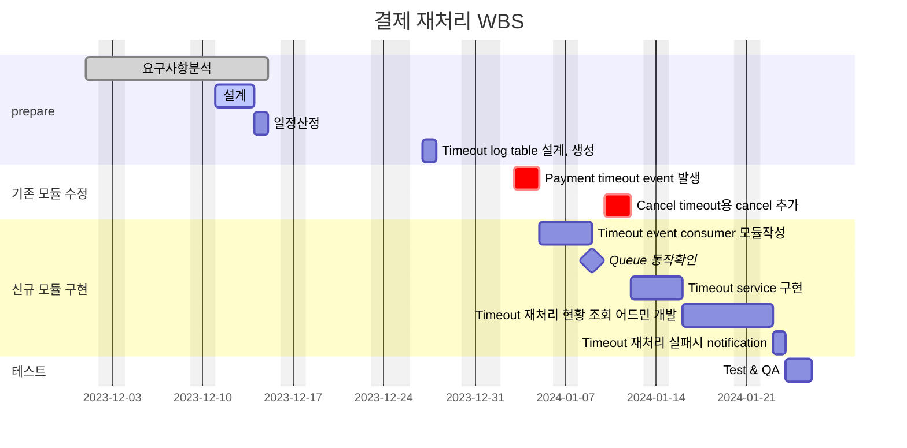

# 🪴 career-WBS
> mermaid로 작성된 과제는 마크다운 파일(WBS.md)로 올려주시면 됩니다. (md 파일 내에 기존 구조를 넣어주세요)  
> 별도 아키택쳐나 모델링 도구를 사용한 경우에는 마크다운 파일(WBS.md)과 png, gif, jpg, pdf 파일 형식으로 WBS-{gitID}.png 파일명으로 upload 해주세요
# 요구사항
- [ ] 개선하려는 프로젝트의 최종 설계
    - [ ] 변경 사항에 대한 Target 시스템 설계를 확정한다. (2주차 미션 활용)
    - [ ] 변경 사항에 대한 기대효과를 확정한다. (2주차 미션 활용)
- [ ] task list 도출
    - [ ] 현 시스템에서 변경되는 부분을 class diagram(DB변경이 발생할 경우 ERD추가)으로 작성
    - [ ] 변경, 추가 될 프로그램들의 작업 목록을 작성한다.
- [ ] 일정 계획 문서 (WBS)
  - [ ] 작업목록의 소요일정을 산정 한다.
  - [ ] 작업 목록의 의존성을 정의 한다.
  - [ ] 작업 목록의 전체 일정을 작성한다.
  - [ ] 진행 상태를 check하기위한 마일스톤 설정 한다.

# 🚀미션
## AS-IS
### AS-IS 개선포인트 분석
- 고객센터 생성 시 게임 플랫폼에 연동하기 위해 고객센터를 등록하는 jira 를 통해 반복적으로 등록하였다.
- 주기적으로 새로운 게임이 추가 되었을때 등록되는 과정을 반복하고 또한 라이브 연동시 같은 작업을 반복해서 등록해주었다.
- 운영자가 고객센터 등록을 항상 해줘야하고, 라이브 동기화 시 별도로 진행하는 부분이 있어 번거롭다.
- 달에는 많을 경우 3-4건 정도되며, 등록 시간은 5-10분정도 소요된다.
- 또한 등록한 뒤 고객센터에 제대로 등록이 되는지 확인하는 작업이 별도로 10분정도 소요된다.
- 제대로 등록이 되지 않을 경우 고객센터 운영자와 고객센터가 제대로 고객센터 시스템에 등록이 되었는지 데이터를 확인해보거나 로그를 확인해본다.
 
### AS-IS 프로세스

### Class diagram
- AS-IS 구조에서 개선을 할때 영향을 받게되는 class diagram을 작성한다.

### ERD
-AS-IS 구조에서 개선을 할때 영향을 받게되는 ERD를 작성한다.

## TO-BE 
### TO-BE 기대효과 분석
- 매달 비효율적으로 발생하던 약1-2시간의 업무를 자동화하여 줄일 수 있다.
- 게임플랫폼 운영자 등록하던 부분을 고객센터 생성 시 게임플랫폼 고객센터 등록 API 호출하도록 변경하여 운영자의 시간과 고객센터를 잘못 등록하는 실수를 줄인다.
- 라이브 동기화 시 별도로 개발환경에서 확인된 고객센터를 동기화 할 수 있도록 변경해서 불필요한 등록 과정을 없애고 실수를 줄인다.
- 또한 운영자가 직접 고객센터의 문의를 등록하여 확인했던 부분을 관리자 툴에서 생성 후 등록해서 확인하는 툴로 변경하여 운영자가 직접 등록해서 테스트하는 번거로움을 줄인다.
 
### TO-BE 프로세스

### class diagram
- class diagram

    

### ERD
- TO-BE 구조에서 변경되는 ERD를 작성한다.

## Task List
1. Timeout 발생 시 Event발생 수정- SQS, SNS  
2. Timeout event subscription module 작성 
3. Timeout log table 설계, 생성 
4. Timeout 재처리 service 설개, 구현 
&nbsp; &nbsp; 1. transaction 성공여부 확인  
&nbsp; &nbsp; 2. transaction 취소 처리 하기 (결제시) 
&nbsp; &nbsp; 3. 재처리 logging(DB) : 처리 횟수(3회), 처리 내역 
5. Timeout 재처리 현황 조회 어드민 page. 
6. Timeout 재처리 실패시 메일 발송 모듈. 

## WBS

- 산정 기준 : 4시간/일

1. 요구사항 분석 : 이미수행
2. 설계 : 3d
3. 일정산정: 1d
4. Timeout 발생 시 Event발생 수정- SQS, SNS : 이미 사용하는 SQS가 있고 큐생성 및 기존코드 수정 : 2d
5. Timeout event subscription module 작성 : SQS, SNS : 이미 사용하는 SQS가 있고 신규 class 생성 : 2d
6. Timeout log table 설계, 생성 : 1d
7. Timeout 재처리 service 설개, 구현 : 2d
    1. transaction 성공여부 확인 : 0.5d
    2. transaction 취소 처리 하기 (결제시) : 0.5d
    3. 재처리 logging(DB) : 처리 횟수(3회), 처리 내역 : 1d
8. Timeout 재처리 현황 조회 어드민 page.: 기존 admin에 메뉴 추가 : 5d
9. Timeout 재처리 실패시 메일 발송 모듈: 기존 notification에 method 추가 : 1d

